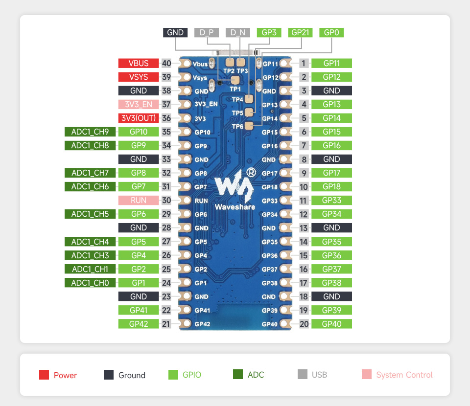
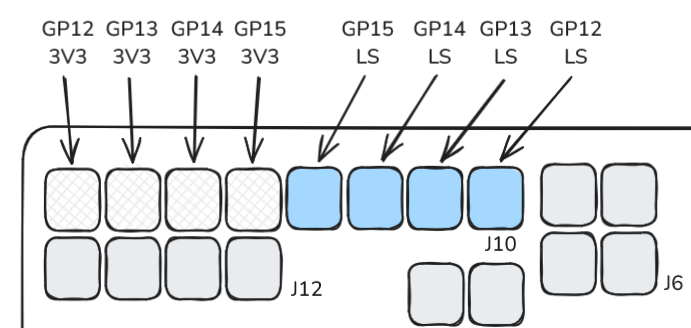
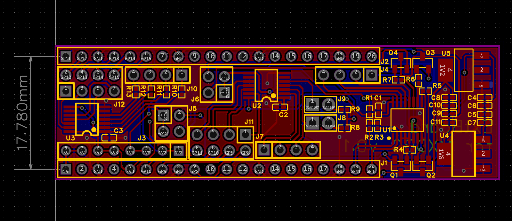
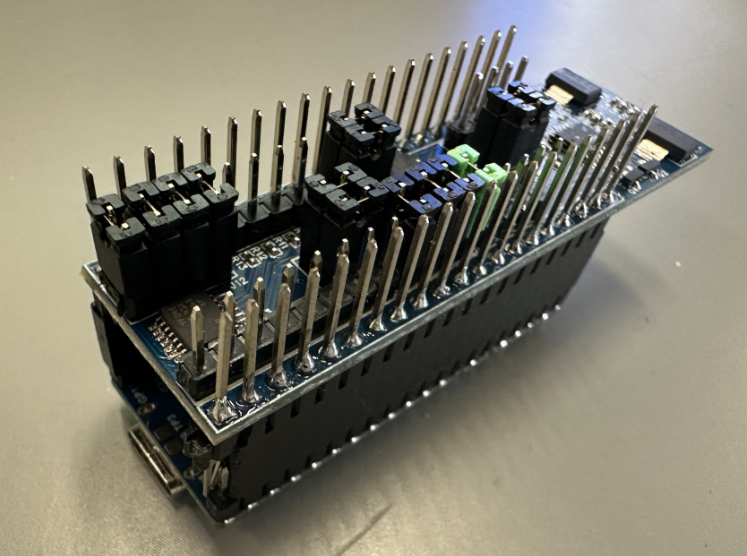

# MXDBG

- **Project Name**: MXDBG
- **Project Brief**: A simple online debugger for x86_64 Windows/Mac/Linux programs. Provide I2C, PWM, GPIO, and SPI(developing) interfaces. This project is made for ESP32-S3. (Before you use it, make sure you have the ESP32-S3 pico board and you are skilled at the embedded development.)
- **Project Status**: In development
- **Develop Language**: C / Python
- **Develop Platform**: Windows / Mac / Linux
- **SDK**: ESP-IDF


## Introduction

This is designed to be easy to use and to provide a simple interface for debugging programs or test environment. It is written in C in Embedded system, and use python for the front-end.



## How to use

### PWM

- PWM pin: Channel `0` (`16`), Channel `1` (`17`), Channel `2` (`18`)
- Frequency: `10KHz`
- Duty cycle: `25%`

```python

from mxdbg import MXDBG

# Create a MXDBG object
dev = MXDBG()

# Set the PWM frequency and duty cycle
ret, data = dev.pwm_config(pin=16, freq=361, duty=0.5, channel=0)
print(ret, data)

# enable the PWM
ret, data = dev.pwm_run_stop(True, channel=0)
print(ret, data)

# disable the PWM
ret, data = dev.pwm_run_stop(False, channel=0)
print(ret, data)

```

### GPIO

- It has no default pins, you can pick any pins you want.
- You can modify the mode, pull up/down, and output value of the GPIO pins.

**NOTE**: GPIOs level-shifted by TXS0104E in `J10` and `J7` are not supported to be used as a power resouce for peripherals.  

```python

from mxdbg import MXDBG

# Create a MXDBG object
dev = MXDBG()

# Set the GPIO mode
ret = dev.gpio_config(pin=33,
                    mode=dev.gpio_mode["GPIO_MODE_OUTPUT"],
                    pull_up=1,
                    pull_down=0)
print(ret)

# Set the GPIO output value
ret, data = dev.gpio_write_read(33, 1)
print(ret, data)

# Get the GPIO input value
ret, data = dev.gpio_write_read(33)
print(ret, data)

```

### I2C

- SCL pin: `11`
- SDA pin: `10`
- Frequency: `400kHz`
- SDA and SCL are pull up in default.(You can not change it through the API for now. It will be added in the future if needed.)


```python

from mxdbg import MXDBG

# Create a MXDBG object
dev = MXDBG()

# Write data to the I2C device
ret, data = dev.i2c_write_read(0x74, [0x06, 0x91], 0)
print(ret, data)

# Read data from the I2C device
ret, data = dev.i2c_write_read(0x74, [0x00], 2)
print(ret, data)

```

### SPI

- MISO pin: `12` (Disabled in half duplex mode)
- MOSI pin: `13` 
- SCK pin: `14`
- CS pin: `15`
- Frequency: `1MHz` in default (Change it using `spi_config()` API)
- Mode: `3` in default (Change it using `spi_config()` API)
- Full duplex in default. (Change it using `spi_config()` API)



```python

from mxdbg import MXDBG

# Create a MXDBG object
dev = MXDBG()

# Config as a half duplex 3-wire mode
ret, data = dev.spi_config(freq=1000000,
                           miso_io_num=-1, # the key point to config as a half duplex 3-wire mode
                           cs_ena_pretrans=1,
                           cs_ena_posttrans=1,
                           device_interface_flags=(dev.spi_device["SPI_DEVICE_HALFDUPLEX"] | dev.spi_device["SPI_DEVICE_3WIRE"])
                           )
print(ret, data)

# Write and read data
for _ in range(100):
    ret, data = dev.spi_write_read([0x01], 1)
    assert data[0] == 0x59, "read_error"
  
```

**NOTE**: If you notice that there are some ringings in the signal, it is because the SPI signal is not stable. You have several methods to solve:
1. Replace the 0Ohm resistors (R10 / R11 / R12 / R13) between the SPI and the device.
2. Increase or decrease the frequency of the SPI signal.


# ExtBoard for MXDBG v0.1




The ExtBoard for MXDBG is connected with ESP32 S3 pico as follow.



Read the [Schematic of ExtBoard for MXDBG](./Documents/SCH_Schematic1_2024-11-15.pdf) for more details.

## Connctors


- **J3**: Extend the power supply output. It supply 4 kinds of power resouce, `1.2V`, `1.8V`, `3.3V` and `5V`.
- **J4**: Supply extention GPIO (`IO0` / `IO5` / `IO6` / `IO7`) from PCA9557PW. Control it through the I2C(port `1`) of MCU.
- **J5**: Connect the `VCCA1` of `U3` to power supply (`1.2V` or `1.8V`). 
- **J6**: Connect the `VCCA2` of `U2` to power supply (`1.2`V or `1.8V`). 
- **J7**: I2C (ports `0`) which were level-shiftted by TXS0104E (`U2`).
- **J8**: Pull-up power supply connected to the SCL of I2C (port `0`).
- **J9**: Pull-up power supply connected to the SDA of I2C (port `0`).
- **J10**: SPI (port `0`) which were level-shiftted by TXS0104E (`U3`).
- **J11**: Connect `GP8 ~ GP11` of ESP32-S3 pico to `B1 ~ B4` of TXS0104E (`U2`).
- **J12**: Connect `GP12 ~ GP15` of ESP32-S3 pico to `B1 ~ B4` of TXS0104E (`U3`).

## How to use

### Expand IO

1. The expand IO (`IO0` / `IO5` / `IO6` / `IO7`) in `J4` connector are controlled by PCA9557PW. You can control it through `expand_io_*()` APIs.
2. You should note that `IO0` is in open-drain mode which means that you cannot pull it up without any pull-up power resouce, and `IO5` / `IO6` / `IO7` are in push-pull mode.

```python
from mxdbg import MXDBG

# Create a MXDBG object
dev = MXDBG()

# Init the expand IO
dev.expand_io_init()

# Set the IO mode
dev.expand_io_config(7, 0) # Set the IO7 as input, 0: input, 1: output

# Set the IO output value
dev.expand_io_write_read(7, 1)

# Get the IO input value
dev.expand_io_write_read(7)
```

### Power Control of SPI/I2C Level Shifter

1. `J5` connector is used for SPI level shifter power supply, and `J6` connector is used for I2C level shifter power supply.
2. You can control the power of SPI/I2C Level Shifter through `power_control()` API.

```python
from mxdbg import MXDBG

# Create a MXDBG object
dev = MXDBG()

# Init the power control of SPI/I2C Level Shifter
dev.power_init()

# Set the power of SPI/I2C Level Shifter
dev.power_control(communication_type="I2C", power_type="0V") # communication_type: "SPI" / "I2C" ; power_type: "0V" / "1V2" / "1V8"
```
