[English](./README.en.md)

# MXDBG

- 项目名称：MXDBG
- 项目简介：
  - 这是一个为 Windows / Mac / Linux 编写的程序，支持 I2C / PWM / SPI / GPIO 等接口。通过 `*_config()` 接口你可以轻松修改对应的参数，只要你知道那些参数是什么意思就行。
  - 本项目基于 ESP32-S3 pico 开发板进行构建，通过 USB 连接到 PC后，你可以通过 pyserial 库与 ESP32 的虚拟串口（USB CDC）进行通信（当然，这些已经做得好了封装，你只需要调用相应的 API 即可）。
  - 同时，本项目还提供了一个扩展板（有两个版本，分别是 `v0.1` 和 `v0.2.1`），用于扩展多电压管理的 I2C / SPI / GPIO 等接口。
- 项目状态：开发中
- 开发语言：C / Python
- 开发平台：Windows / Mac / Linux
- SDK：ESP-IDF

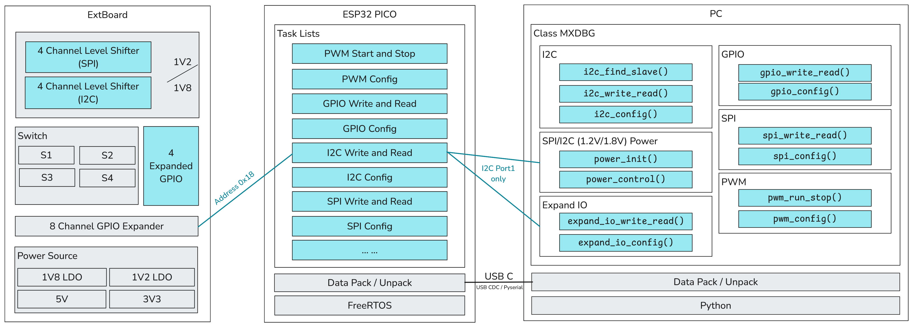

## 介绍

本项目的开发是为了统一多个平台（PC 如 Windows / Linux，嵌入式如 FTDI / STM32 / ESP32 等）的调试环境，同时也为了方便调试程序。本项目的前端使用 Python 编写，后端使用 C 编写。本项目的前端使用了 pyserial 库，用于与 ESP32 的虚拟串口（USB CDC）进行通信。

下面是 ESP32 Pico 的硬件接口示意图，使用时（尤其是 GPIO）请参考下方的引脚定义图。

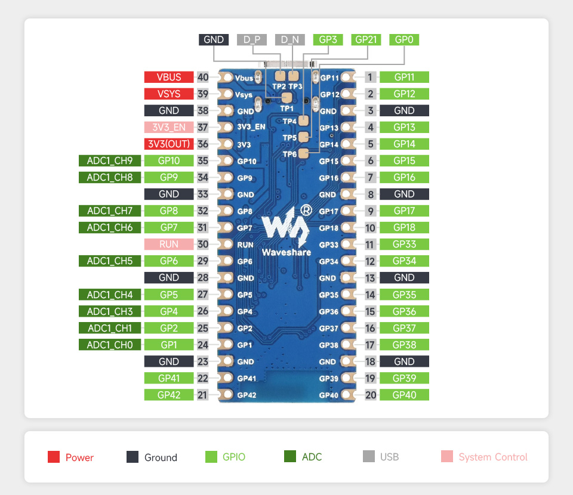

## 如何使用

### PWM

- PWM 引脚：通道 `0`（`16`），通道 `1`（`17`），通道 `2`（`18`）
- 频率：`10KHz`
- 占空比：`25%`

```python

from mxdbg import MXDBG

# 创建一个 MXDBG 对象
dev = MXDBG()

# 设置 PWM 频率和占空比
ret, data = dev.pwm_config(pin=16, freq=361, duty=0.5, channel=0)
print(ret, data)

# 启动 PWM
ret, data = dev.pwm_run_stop(True, channel=0)
print(ret, data)

# 关闭 PWM
ret, data = dev.pwm_run_stop(False, channel=0)
print(ret, data)

```

### GPIO

- GPIO 没有默认引脚，你可以选择任何你想要的引脚。
- 你可以修改 GPIO 引脚的模式、上拉/下拉、输出值。

**注意**：在 ExTBoard for MXDBG v0.1 上使用时，`J10` 和 `J7` 中的 GPIO 由 TXS0104E 芯片进行电平转换，不支持用作外设的电源。

```python

from mxdbg import MXDBG

# 创建一个 MXDBG 对象
dev = MXDBG()

# 设置 GPIO 模式
ret = dev.gpio_config(pin=33,
                    mode=dev.gpio_mode["GPIO_MODE_OUTPUT"],
                    pull_up=1,
                    pull_down=0)
print(ret)

# 设置 GPIO 输出值
ret, data = dev.gpio_write_read(33, 1)
print(ret, data)

# 获取 GPIO 输入值
ret, data = dev.gpio_write_read(33)
print(ret, data)

```

### I2C

- 引脚：`SCL`（`11`），`SDA`（`10`）
- 频率：`400KHz`
- SDA 和 SCL 默认是不上拉的（也就是说，可能你会通信失败），如果需要上拉，可以通过 `i2c_config()` 接口设置。
- `PORT 1`是用来做电源管理的，普通用户请不要使用。

在 ExTBoard for MXDBG v0.1 上使用时，I2C 引脚定义如下：

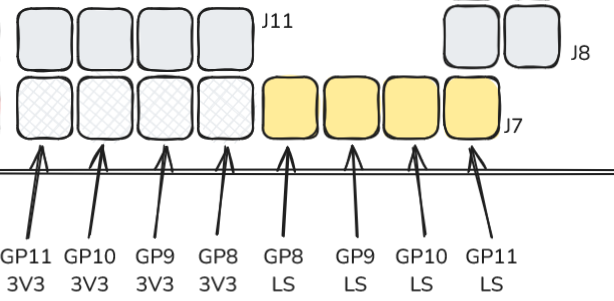

```python

from mxdbg import MXDBG

# 创建一个 MXDBG 对象
dev = MXDBG()

# 设置 I2C 频率
ret = dev.i2c_config(freq=400000)

# 写入 I2C 设备
ret, data = dev.i2c_write_read(0x74, [0x06, 0x91], 0)
print(ret, data)

# 读取 I2C 设备
ret, data = dev.i2c_write_read(0x74, [0x00], 2)
print(ret, data)

```

### SPI

- 引脚：`MISO`（`12`），`MOSI`（`13`），`SCK`（`14`），`CS`（`15`）
- 频率： 默认 `1MHz`
- 模式：默认 `3`
- 全双工模式（可以修改）

在 ExTBoard for MXDBG v0.1 上使用时，SPI 引脚定义如下：

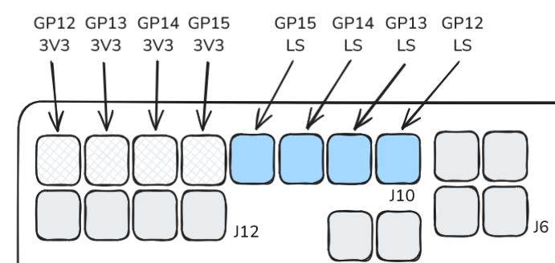


```python

from mxdbg import MXDBG

# 创建一个 MXDBG 对象
dev = MXDBG()

# 设置 SPI 频率和模式 为 3线半双工模式
ret, data = dev.spi_config(freq=1000000,
                           miso_io_num=-1, # the key point to config as a half duplex 3-wire mode
                           cs_ena_pretrans=1,
                           cs_ena_posttrans=1,
                           device_interface_flags=(dev.spi_device["SPI_DEVICE_HALFDUPLEX"] | dev.spi_device["SPI_DEVICE_3WIRE"])
                           )
print(ret, data)

# 写入和读取数据
for _ in range(100):
    ret, data = dev.spi_write_read([0x01], 1)
    assert data[0] == 0x59, "read_error"

```

**注意**：若你观察到 SPI 信号上有些振铃，那是因为 SPI 信号不稳定，可以通过以下方法尝试解决：
1. 增加或降低 SPI 时钟频率。
2. 替换 SPI 外设和设备间的 `0hm` 电阻为 `50ohm` （或 `33Ohm` 等） 电阻。

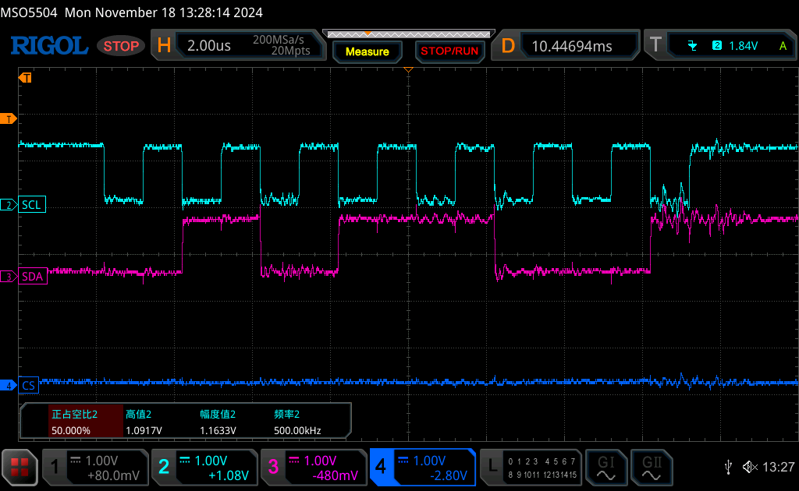


## Q/A

### Q: 如何知道我使用的扩展板是哪个版本？

A: 通过 `dev.get_extboard_version()` 接口可以获取扩展板的版本号。

### Q: 我可以通过 PC 控制 ESP32 进行复位吗？

A: 可以，通过 `dev.restart()` 接口可以控制 ESP32 进行复位，此时 ESP32 S3 的 USB 会从 PC 上断开，你需要通过 `dev = MXDBG()` 重新创建一个 MXDBG 对象。

# ExtBoard for MXDBG v0.1

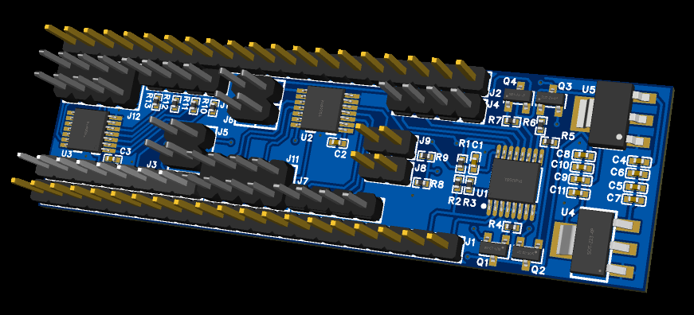

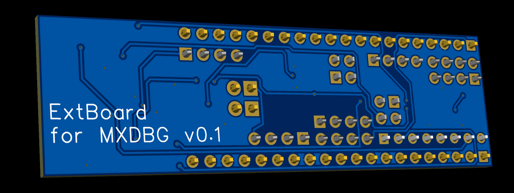

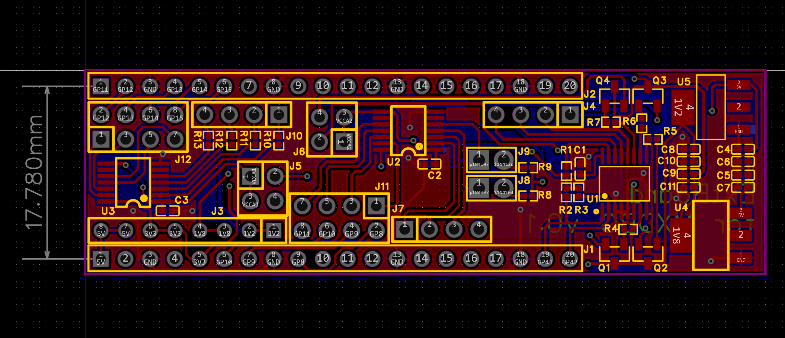

ExtBoard for MXDBG v0.1 与 ESP32-S3 Pico 开发板连接方式如下：

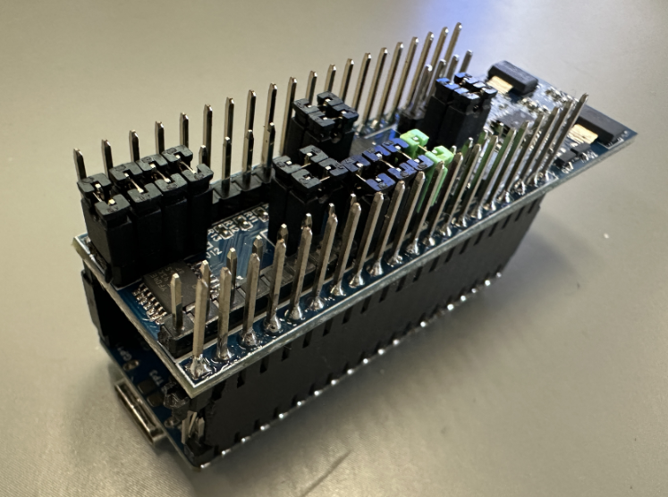

查阅 [Schematic of ExtBoard for MXDBG](./Documents/SCH_Schematic_ExtBoard_for_MXDBG_v0.1_2024-11-15.pdf) 以获取更多信息。

## 连接引脚

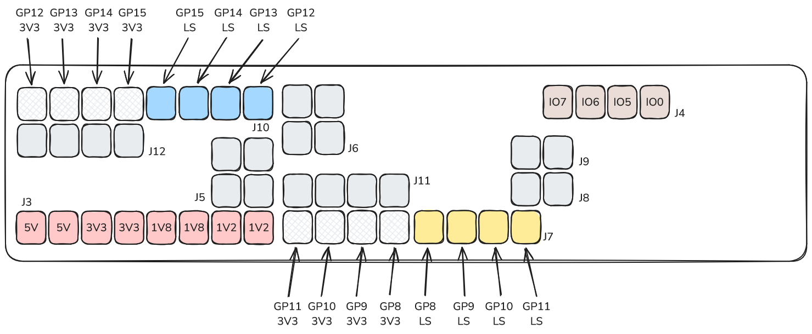

- J3: 扩展供电接口，提供了四类电源输出，分别是 `1.2V` / `1.8V` / `3.3V` / `5V`
- J4: 提供扩展 GPIO （`3.3V`）（`IO0` / `IO5` / `IO6` / `IO7`）。
- J5: 影响着 U3 芯片的电源供应（`1.2V` 或 `1.8V`），需要连接。
- J6: 影响着 U2 芯片的电源供应（`1.2V` 或 `1.8V`），需要连接。
- J7: 影响着 I2C 外设 的 level shifter 功能，需要连接。
- J8: 影响着芯片的 I2C SCL 的上拉功能，需要连接。
- J9: 影响着芯片的 I2C SDA 的上拉功能，需要连接。
- J10: 影响着 SPI 外设 的level shifter 功能，需要连接。
- J11: 连接着 ESP32-S3 Pico 的 `GP8` ~ `GP11` 到 TXS0104E （`U2`）的 `B1` ~ `B4`。
- J12: 连接着 ESP32-S3 Pico 的 `GP12` ~ `GP15` 到 TXS0104E （`U3`）的 `B1` ~ `B4`。

## 如何使用

### 扩展 GPIO

1. 扩展 GPIO 需要通过 PCA9557PW 控制，已集成至 `expand_io_write_read()` 接口中，会通过内部的 I2C1 连接到 MCU。
2. 需要注意的是，IO0 是开漏的，也就是说，如果你不额外连接上拉电阻，那么你的 IO0 将无法通过 `expand_io_write_read()` 接口上拉至高电平。

```python

from mxdbg import MXDBG

# 创建一个 MXDBG 对象
dev = MXDBG()

# 设置 IO 模式
dev.expand_io_config(7, 0) # 设置 IO7 为输入，0: 输入，1: 输出

# 设置 IO 输出值
dev.expand_io_write_read(7, 1)

# 获取 IO 输入值
dev.expand_io_write_read(7)

```

### SPI/I2C Level Shifter 的电源控制

1. `J5` 连接器用于 SPI level shifter 的电源供应，`J6` 连接器用于 I2C level shifter 的电源供应。
2. 你可以通过 `power_control()` 接口控制 SPI/I2C Level Shifter 的电源。

```python

from mxdbg import MXDBG

# 创建一个 MXDBG 对象
dev = MXDBG()

# 控制 SPI/I2C Level Shifter 的电源
dev.power_control(communication_type="I2C", power_type="0V") # communication_type: "SPI" / "I2C" ; power_type: "0V" / "1V2" / "1V8"

```

# ExtBoard for MXDBG v0.2.1

相比于 `v0.1` 版本，`v0.2.1` 版本的扩展板提供了更多的功能，如下：

1. 支持在同一个 SPI / I2C 连接口上修改成 `1.2V` / `1.8V` / `3.3V` ，以便用户在不需要重新插拔设备的情况下多电压测试通信。
2. 减少了许多不必要的连接器，使得板子更加简洁。
3. 对主要的通信方式 (SPI / I2C) 进行丝印标记，方便用户使用。
4. 同时增加了 4个GPIO 可控的电源，支持直接从 LDO 引出电源，以解决之前版本扩展IO不能为设备供电的问题。

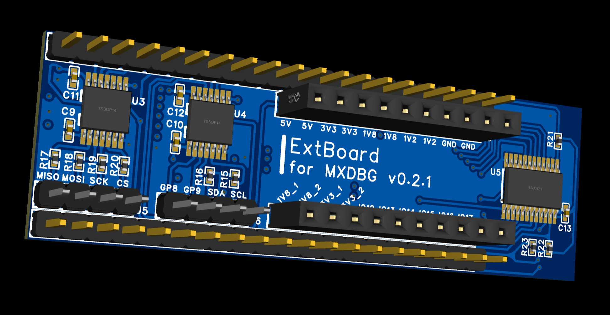

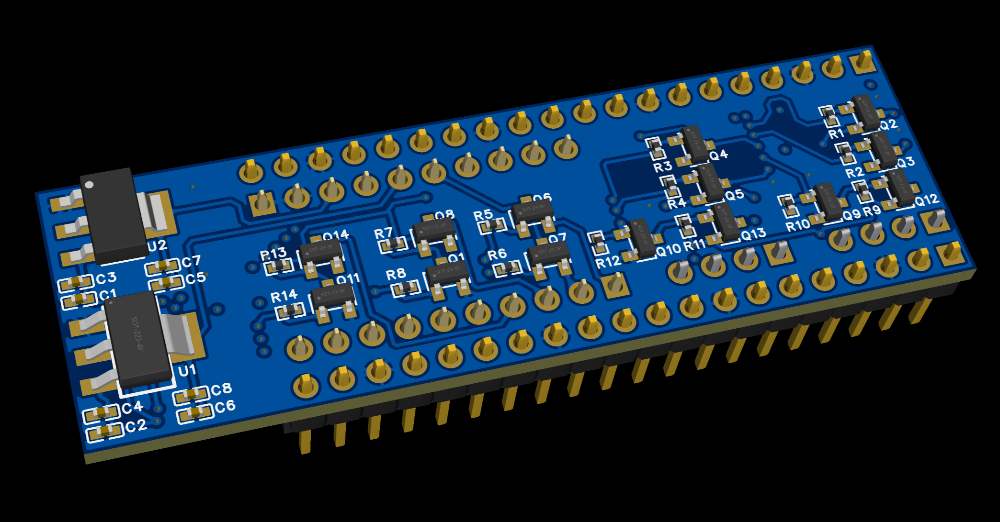

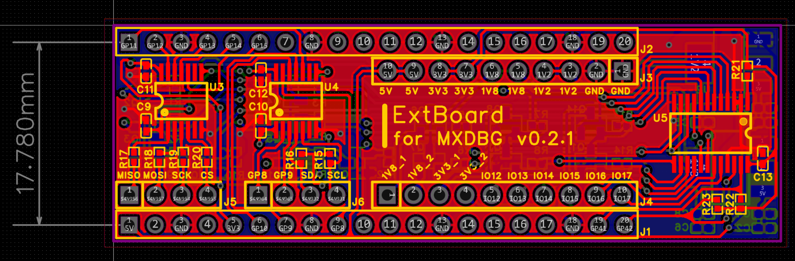

ExtBoard for MXDBG v0.2.1 与 ESP32-S3 Pico 开发板连接方式如下：

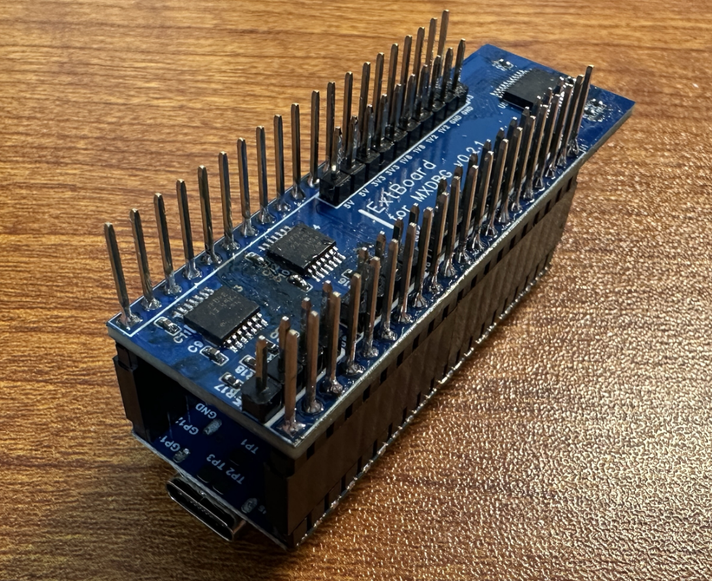

查阅 [Schematic of ExtBoard for MXDBG](./Documents/SCH_Schematic_ExtBoard_for_MXDBG_v0.2.1_2024-11-23.pdf) 以获取更多信息。

## 连接引脚

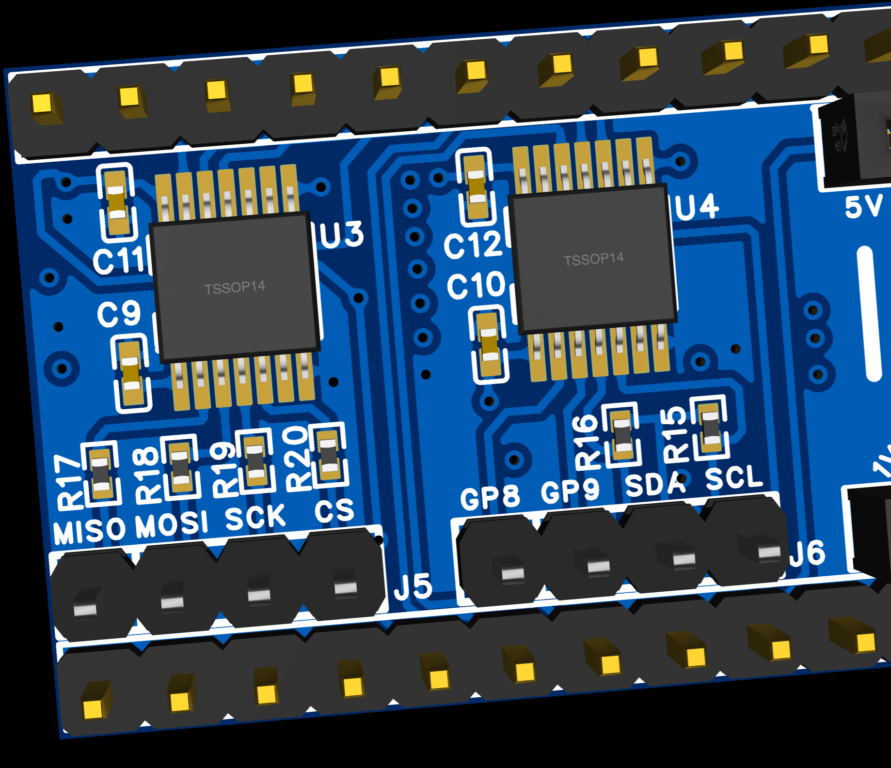

- J3: 扩展供电接口，提供了四类电源输出和GND，电源输出（带有丝印）分别是 `1.2V` / `1.8V` / `3.3V` / `5V`。
- J4: 提供 4个可控电源输出，支持直接从 LDO 引出电源（丝印分别是 `1V8_1` / `1V8_2` / `3V3_1` / `3V3_2`）;以及 6个 GPIO （`3.3V`）（`IO12` / `IO13` / `IO14` / `IO15` / `IO16` / `IO17`）。
- J5: 提供 SPI 连接器，包括 `MISO` / `MOSI` / `SCK` / `CS`。
- J6: 提供 I2C 连接器，包括 `SCL` / `SDA`; 以及 2个 GPIO （`3.3V`）（`GP8` / `GP9`）。

## 如何使用

### 扩展GPIO

1. `IO12` ~ `IO17` 默认是输入拉高模式，也就是说他虽然是输入模式，但是它能被检测到 `3.3V`，并且这一点（暂时）无法修改。
2. 使用方法与 ExtBoard v0.1 一致。

### 额外电源接口

1. ExtBoard v0.2.1 相较 ExtBoard v0.1 提供了4个由 GPIO 控制的电源，直接从 LDO 引电为设备提供开关支持。
2. 控制方法和普通的扩展GPIO 一致，只是不支持使用 `expand_io_config()` 进行修改（防止用户误修改）。

> 同时，ExtBoard v0.2.1 和 ExtBoard v0.1 都支持了使用 数字（`int`） 或 字符串 (`str`) 来指定需要控制的引脚。

```python

from mxdbg import MXDBG

# 创建一个 MXDBG 对象
dev = MXDBG()

# the power resource pins has 3 ways to control, just as follows.

ret, data = dev.expand_io_write_read("1v8_1", 1) 
print(ret, data)

ret, data = dev.expand_io_write_read("IO6", 1)
print(ret, data)

ret, data = dev.expand_io_write_read(6, 1)
print(ret, data)

```

测试了一下用 python 控制 `1v8_1` 口极限上下电，发现速率最高大概在 `50Hz`，基本上算是能用的水平，毕竟还有通信开销。

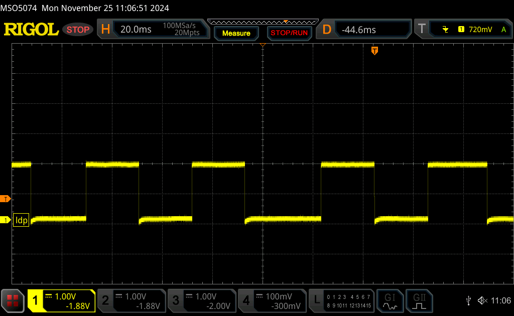

经测试，虽然 `3v3_1` 和 `3v3_2` 都有些下电缓慢，从 `3.3V` 下降到 `0.99V` 以下需要 `1ms`，但是 USB 的通信速率根本碾不上，所以不用担心。

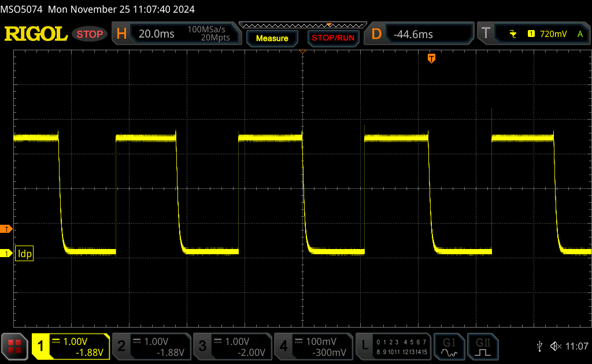

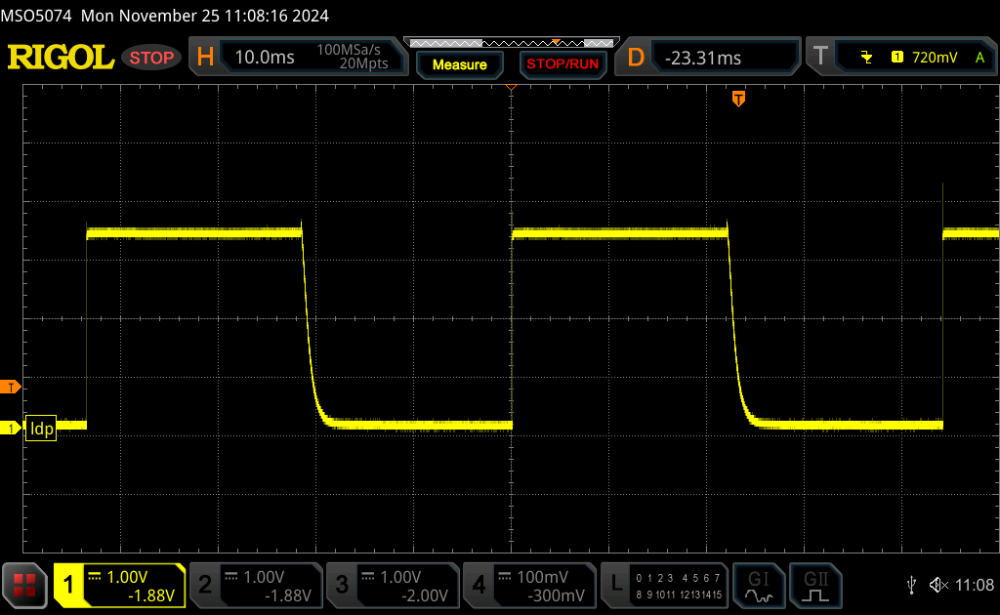

### SPI/I2C Level Shifter 的电源控制

加入了对 `3.3V` 电源控制的功能，其他特性与 ExtBoard v0.1 保持一致。
