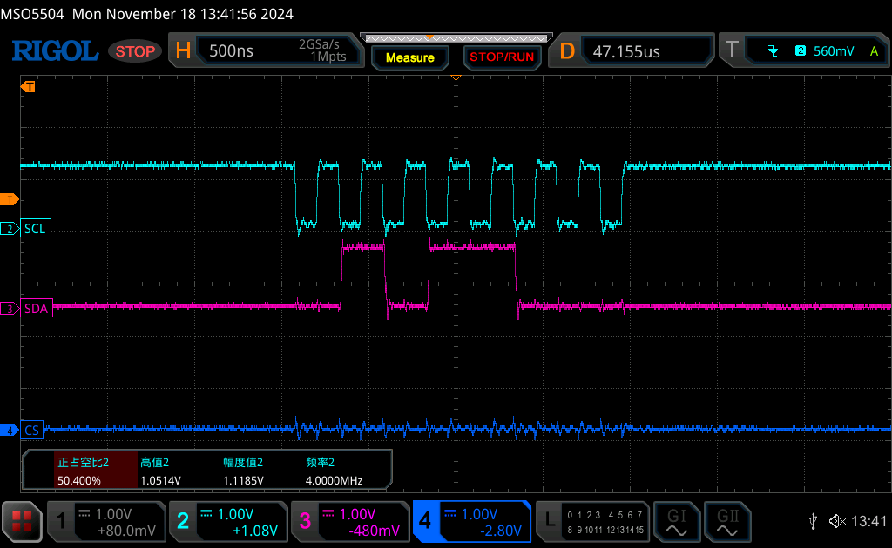

# User Manual

MXDBG 其实是一款建议的调试器，基础功能是用 ESP32 S3 实现的，大部分内容会跑在 PC 端，由 python 来检查和控制操作。

# API


## PWM

控制 FYDB504T 步进电机相关的代码可以参考：《[FYDB504T Motor Driver](https://flowus.cn/isletspace/share/a2ba0fc0-67ce-4454-831e-ba451aac2e65?code=FP7RNR)》。

- PWM pin: Channel `0` (`16`), Channel `1` (`17`), Channel `2` (`18`)
- Frequency: `10KHz`
- Duty cycle: `25%`

```python

from mxESP32Debugger.debugger import Dbg as MXDBG

# Create a MXDBG object
dev = MXDBG()

# Set the PWM frequency and duty cycle
ret, data = dev.pwm_config(pin=16, freq=361, duty=0.5, channel=0)
print(ret, data)

# enable the PWM
ret, data = dev.pwm_run_stop(True, channel=0)
print(ret, data)

# disable the PWM
ret, data = dev.pwm_run_stop(False, channel=0)
print(ret, data)

```

## GPIO

- It has no default pins, you can pick any pins you want.
- You can modify the mode, pull up/down, and output value of the GPIO pins.

**NOTE**: GPIOs level-shifted by TXS0104E in `J10` and `J7` are not supported to be used as a power resouce for peripherals.  

```python

from mxESP32Debugger.debugger import Dbg as MXDBG

# Create a MXDBG object
dev = MXDBG()

# Set the GPIO mode
ret = dev.gpio_config(pin=33,
                    mode=dev.gpio_mode["GPIO_MODE_OUTPUT"],
                    pull_up=1,
                    pull_down=0)
print(ret)

# Set the GPIO output value
ret, data = dev.gpio_write_read(33, 1)
print(ret, data)

# Get the GPIO input value
ret, data = dev.gpio_write_read(33)
print(ret, data)

```

## I2C

- SCL pin: `11`
- SDA pin: `10`
- Frequency: `400kHz`
- SDA and SCL are ***NOT*** pull up in default.

In the Extboard for MXDBG v0.1, the I2C pin defined as follow:


```python

from mxESP32Debugger.debugger import Dbg as MXDBG

# Create a MXDBG object
dev = MXDBG()

# Write data to the I2C device
ret, data = dev.i2c_write_read(0x74, [0x06, 0x91], 0)
print(ret, data)

# Read data from the I2C device
ret, data = dev.i2c_write_read(0x74, [0x00], 2)
print(ret, data)

```

## SPI

- MISO pin: `12` (Disabled in half duplex mode)
- MOSI pin: `13` 
- SCK pin: `14`
- CS pin: `15`
- Frequency: `1MHz` in default (Change it using `spi_config()` API)
- Mode: `3` in default (Change it using `spi_config()` API)
- Full duplex in default. (Change it using `spi_config()` API)

In the Extboard for MXDBG v0.1, the SPI pin defined as follow:


```python

from mxESP32Debugger.debugger import Dbg as MXDBG

# Create a MXDBG object
dev = MXDBG()

# Config as a half duplex 3-wire mode
ret, data = dev.spi_config(freq=1000000,
                           miso_io_num=-1, # the key point to config as a half duplex 3-wire mode
                           cs_ena_pretrans=1,
                           cs_ena_posttrans=1,
                           device_interface_flags=(dev.spi_device["SPI_DEVICE_HALFDUPLEX"] | dev.spi_device["SPI_DEVICE_3WIRE"])
                           )
print(ret, data)

# Write and read data
for _ in range(100):
    ret, data = dev.spi_write_read([0x01], 1)
    assert data[0] == 0x59, "read_error"
  
```

**NOTE**: If you notice that there are some ringings in the signal, it is because the SPI signal is not stable. You have several methods to solve:
1. Replace the 0Ohm resistors (R10 / R11 / R12 / R13) between the SPI and the device.
2. Increase or decrease the frequency of the SPI signal.





